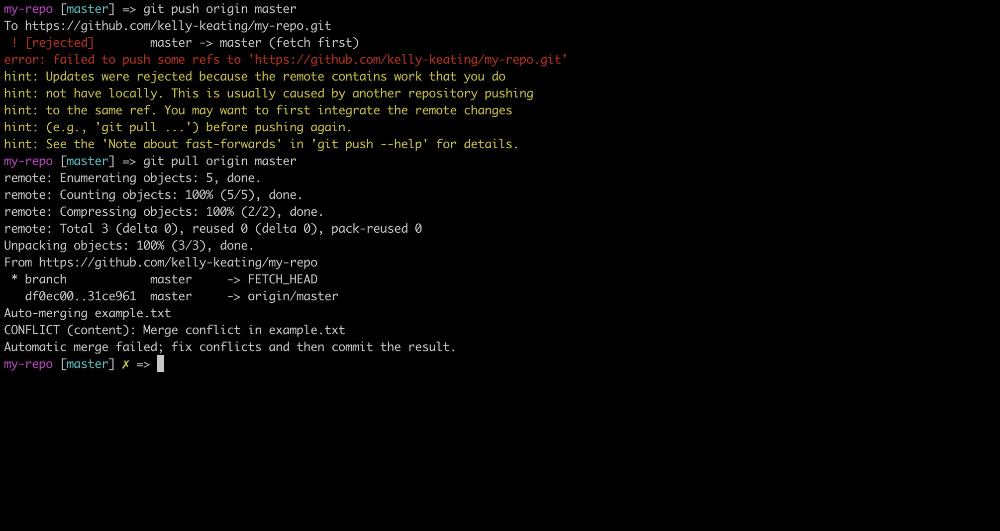
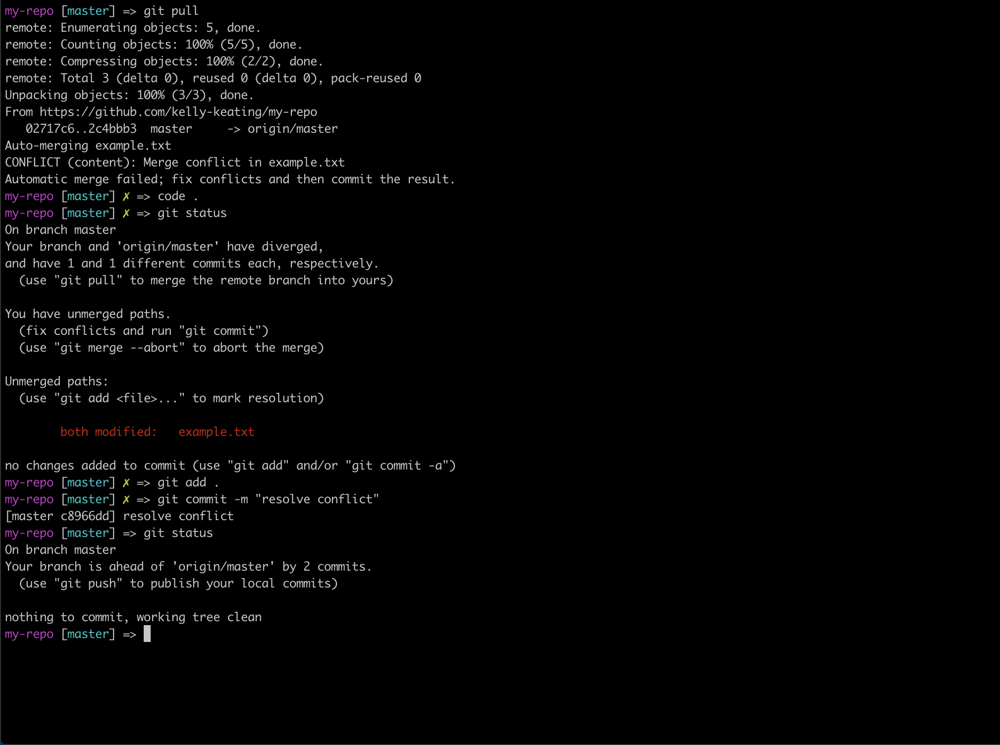

[Dashboard](/README.md) | [Resources ](README.md) |
------------|----------|

# How to Resolve Git Conflicts

Sometimes when you `git pull` work into a repo you have been working in you will find that a file you have been working has an issue when you pull. This is known as a "merge conflict". Someone else has been making changes to the document too!

In this situation, Git isn't sure which file it should be using, and it marks the file as a conflict. In order to resolve this, we need to have a look at the file and tell Git which piece of code is the one to use.

## Context

## Steps to resolve a conflict

<figure>
  <figcaption>
    
<strong>Figure 1:</strong> Pulling from a remote that creates a conflict 

  </figcaption>
   
</figure>  
Here Git gives us a polite little message to let us know that there are conflicts in our work; and that we must resolve the conflicts then commit the changes.

<figure>
  <figcaption>
    
<strong>Figure 2:</strong> Resolving a conflict in your text editor 

  </figcaption>
   
</figure>  
Git once again is helping us out a lot here. You can see it inserts "Head Markers" into our document to signpost for us very clearly where the conflicting changes are.
Now it's time to delete the code we don't want.  

<figure>
  <figcaption>
    
<strong>Figure 3:</strong> Pushing the fixed branch back up to Github 

  </figcaption>
   
</figure>  
With the unwanted code deleted, now it's just a matter of staging, committing and pushing the beautiful new branch up to Github.
