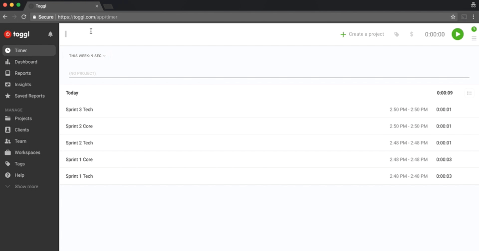
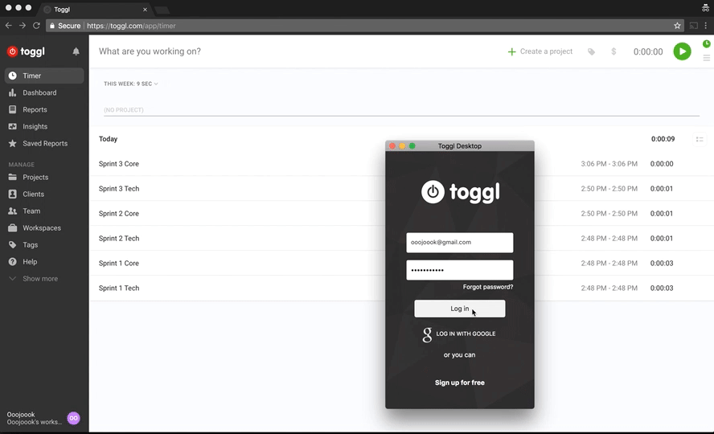

[Dashboard](/README.md) | [Resources ](README.md) | [Sprint 1 Home](/sprints/sprint-1/README.md) |
------------|----------|-----------|

# Track your time - Use toggl 

### Learning Competencies
- Sign up to toggl 
- Setup toggl time tracking (naming) conventions

## Summary
During the prep-curriculum you were introduced to the importance of developing habits, in this case for time managment and productivity. 

How long you spend on each activity is important to know. You and your facilitator use this information.  

If you haven't already, sign up for an account at [toggl](https://github.com/dev-academy-programme/student-prep/pull/3) and download the desktop app

## TimeBox

Activity | Timebox |
------------|----------|
Create account and download | 5 minutes

## Instructions 

Ultimately it is up to you how you manage your time but a potentially useful way to manage/record your time using toggl is to create the toggl entries for each of the sprints before you start. For Example:

1. Create 10 toggl entries (figure 1) 
    - Sprint 1 Tech 
    - Sprint 1 Core 
    - Sprint 2 Tech 
    - Sprint 2 Core   
    etc.

<figure>
  <figcaption>
    
<strong>Figure 1:</strong> Creating toggl entries for each sprint 

  </figcaption>
   
</figure>

2. Use desktop App to track time (figure 2)
Every time you are working on course material,use the appropriate entry. Include workshops and check-in's. At the end of the sprint you'll be asked how long you spent on each sprint. 

<figure>
  <figcaption>
    
<strong>Figure 2:</strong> Tracking time using desktop app 

  </figcaption>
   
</figure>

